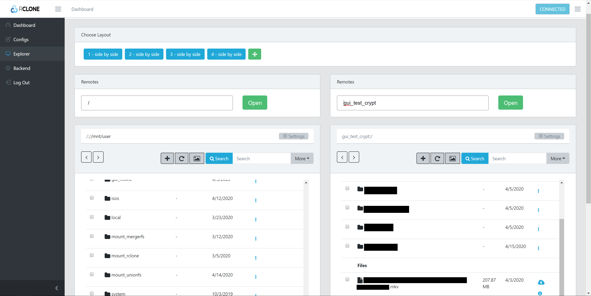
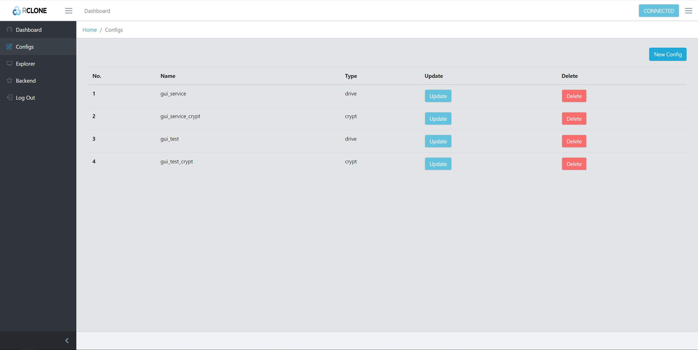

# Rclone Mount & Upload Scripts for Plex Users

<b>New Configuration File Setup</b>

All user settings for the script are now definfined in the config.cfg (or user specified) file which, if not present, can be automatically created using the rclone_setup_config script.

To migrate to this build from previous scripts, simply input your config values into the rclone_setup_config and run the script. Be mindful that the format of some items have changed so use the new format (particularly on mountfolders which is now: MountFolders={downloads/{complete,intermediate,seeds},movies,tv}). Please use the new format for MountFolder or it will not create/mount the correct folders. 

<b>Note: All scripts reference the config file location. This setting is present in all the scripts and found within the first few lines (configfile="/mnt/../rclone/config.cfg") - Please ensure that this points to the correct file location which was set when you ran the rclone_setup_config script. If you left this as the default location, no need to modify any scripts besides the setup_config script.</b>

<b>Use of a config file will make any script updates much easier. You will simply have to copy and paste the updated script and will not need to re-enter all your old values.</b>
<ul>

If you use multiple instances of the upload/mount script, you can create multiple config files. Change the configfile="/mnt/.../rclone/XXXX.cfg" to reflect the name for the new config script and re-run the setup_config script. Then edit the configfile value manually in the mount/upload scripts to reflect the new config name. 

</ul>

## Rclone Beta WebGUI

Modifications by Watchmeexplode5 based on <a href="https://github.com/BinsonBuzz/unraid_rclone_mount">BisonBuzz's</a> rclone mount/move scripts for Unraid.

This branch utilizes the new Beta GUI for Rclone. It should be noted that this is early in development phase and many settings/features within the gui may not function fully. For rclone stats to be displayed properly all rclone activity (mount/move/copy) must be pushed through a single rclone instance. This is different when compared to the original scripts which called a new instance of rclone for every function. For this to function correctly the scripts now utilize rclones Remote Control commands (RC). RC, although fairly mature at this point, comes with its own set of challenges and limitations. Documentation within the script settings should note any limitations within the specific user settings. 

<b>Caveats to the WebGui</b>
<ul>
<b>Ensure you are using the latest rclone stable or rclone beta pluggin via Community Apps</b>

<b>WebGui is still fairly beta. Although editing settings within the gui may work in many cases.....there is a decent change it won't work. Best to leave the config edits to be done through the scripts.</b>

<b>Service Accounts:</b> Since it relies on a single instance of rclone, we cannot utilize the traditional flags that make rclone function so smoothly. For most instances this doesn't cause issues but does require us to utilize Service Accounts differntly. To utilize service accounts within the WebGui mode you must have another remote (or 2 if you use encryption) within your rclone.conf which reference the service account. On upload, the service account remote will be configured to use the correct sa_rotation for authorization. 
	<ul>
	<li>This method ensures that your primary remote (used during the mount script and any time you read files from the mount!) is not modified. This method removes the possible issues that could occur by changing the remote authorization level while the remote is being accessed.</li>
	<li>See rclone.conf for example of configuration file with separate service account remotes</li>
	</ul>
	

<b>Exclusion/Inclusion rules:</b> (as of present) Rules are currently handled differently through RC. RC Api struggles with filter commands which requires a work around for exclusion rules. Exclusion rules are now set within appdata/other/rclone/remotes/YOURREMOTE/exclusion.txt. This file is automatically created when running the script with WebGui enabled. The script is written to exlucude /downloads and partial files (just like the original script). Feel free to manually edit the exclusion.txt file if you require more exclusions (or simply stash exclude files witin your /local/downloads/ where they will not be touched). 

 Presently, a custom minimum age exclusion does not work due to a parsing bug in rclone (known and should and is pending fixes by rclone developers). The scripts have included a work around for this issue and place a minimum age of 15 minutes for the pending upload files. This may/may not be fixed quickly depending on rclone devs (it's a minor issue so it may take time). 

<b>Additional Scripts:</b> Other scripts have been included within the "other useful scripts" folder. This includes shutting down the rclone rc instance (created by mount script), a script to reset/clear rclones statistics, and a fusermount script (credit: teh0wner) if you are having hanging array on stop.

</ul>
For detailed documentation about Rclones RC functions see: https://rclone.org/rc/
 

## Screenshots
### Dashboard

### Remote Explorer

### Remotes

## Original Documentation

 
Collection of scripts to create rclone google mounts to allow fast launch times with Plex (or Emby).  

The main thread for more support: https://forums.unraid.net/topic/75436-guide-how-to-use-rclone-to-mount-cloud-drives-and-play-files/.

<b>Credits:</b>

Thanks to <a href="https://github.com/SenpaiBox">SenPaiBox</a> and the Unraid community for help in refining the scripts.

<b>Unraid Users Requirements:</b>
<ul>
	<li><b>Unraid Rclone Plugin</b>
		<ul>
			<li>1.5.1 or higher needed <b><a href="https://forums.unraid.net/topic/51633-plugin-rclone/">Details</a></b></li>
			<li>Installs rclone and allows the creation of remotes and mounts</li>
		</ul>
	<li><b>Optional: Unraid CA User Scripts Plugin</b></li>
		<ul>
			<li>Best way to run scripts<b> <a href="https://forums.unraid.net/topic/48286-plugin-ca-user-scripts/">Details</a></b>
		</ul>
	<li><b>Optional: Create <a href="https://github.com/xyou365/AutoRclone">Service Accounts (follow steps 1-4)</a>.</b>
		<ul>
			<li>To mass rename the service accounts use the following steps:</li>
			<ul>
				<li>Place Auto-Genortated Service Accounts into /mnt/user/appdata/other/rclone/service_accounts/</li>
				<li>Run the following in terminal/ssh</li>
				<ul>
					<li>Move to directory: cd /mnt/user/appdata/other/rclone/service_accounts/</li>
					<li>Dry Run:</li>
						<ul>
							<li>n=1; for f in *.json; do echo mv "$f" "sa_gdrive_upload$((n++)).json"; done</li>
						</ul>				
					<li>Mass Rename:
						<ul>
							<li>n=1; for f in *.json; do mv "$f" "sa_gdrive_upload$((n++)).json"; done</li>
						</ul>
				</ul>
			</ul>
		</ul>
</ul>
<b>Non-unRaid Users</b>

Other users need to install rclone and use their preferred way to schedule cron jobs.  The scripts install mergerfs, which I think should work for other systems.

<li><b>Optional: Create <a href="https://github.com/xyou365/AutoRclone">Service Accounts (follow steps 1-4)</a>.</b></li>
		<ul>For mass renaming: See steps in Unraid Requirements above
		</ul>

<b>How It Works </b>
<ol>
	<li>Rclone is used to access files on your google drive and to mount them in a folder on your server e.g. mount a gdrive remote called gdrive_vfs: at /mnt/user/mount_rclone/gdrive_vfs </li>
	<li>Mergerfs is used to merge files from your rclone mount (/mnt/user/mount_rclone/gdrive_vfs) with local files that exist on your server and haven't been uploaded yet (e.g. /mnt/user/local/gdrive_vfs) in a new mount /mnt/user/mount_unionfs/gdrive_vfs</li>
		<ul>
			<li>This mergerfs mount allows files to be played by dockers such as Plex, or added to by dockers like radarr etc without the dockers even being aware that some files are local and some are remote.  It just doesn't matter</li>
			<li>The use of a rclone vfs remote allows fast playback, with files streaming within seconds</li>
			<li>New files added to the mergerfs share are actually written to the local share, where they will stay until the upload script processes them
		</ul>
	<li>An upload script is used to upload files in the background from the local folder to the remote.  This activity is masked by mergerfs i.e. to plex, radarr etc files haven't 'moved'</li>
</ol>
<b>Getting Started </b>
<ol>
	<li>Rclone remote setup </li> 
		<ul>
			<li>Install the rclone plugin and via command line run rclone config and create 1-2 remotes:</li> 
				<ol>
					<li>Required: gdrive: - a drive remote that connects to your gdrive account.  Recommend creating your <a href="https://rclone.org/drive/#drive-client-id">own client_id</a></li>
					<li>Recommended: gdrive_media_vfs: - a crypt remote that is mounted locally and decrypts the encrypted files uploaded to gdrive:</li>
				</ol>
		</ul>
	

	<li>Once complete your rclone_config file should look something like this:</li>
	

<i>
[gdrive]
 type = drive
 client_id = UNIQUE CLIENT_ID
 client_secret = MATCHING_UNIQUE_SECRET
 scope = drive
 root_folder_id = xxxx
 token = {"xxxxx"}
 server_side_across_configs = true

[gdrive_media_vfs]
 type = crypt
 remote = gdrive:crypt
 filename_encryption = standard
 directory_name_encryption = true
 password = PASSWORD1
 password2 = PASSWORD2
	</i>

<li>Or, like this if using service accounts:</li>
	

<i>	
	
	
[gdrive]
 type = drive
 scope = drive
 service_account_file = /mnt/user/appdata/other/rclone/service_accounts/sa_gdrive.json
 team_drive = TEAM DRIVE ID
 server_side_across_configs = true

[gdrive_media_vfs]
 type = crypt
 remote = gdrive:crypt
 filename_encryption = standard
 directory_name_encryption = true
 password = PASSWORD1
 password2 = PASSWORD2
	</i>
	
	
	
If you need help doing this, please consult the forum thread above.

<b> It is advisable to create your own client_id to avoid API bans.  <a href="https://rclone.org/drive/#making-your-own-client-id">More Details</a></b>

	<li>Mount script</li>
		<ul>
			<li>Create a new script using the the user scripts plugin and paste in the rclone_mount script</li>
			<li>Edit the config lines at the start of the script to choose your remote name, paths etc</li>
			<li>Choose a suitable cron job. I run this script on a 10 min */10 * * * * schedule so that it automatically remounts if there’s a problem.</li>
			<li>The script:</li>
			<ul>
				<li>Checks if an instance is already running, remounts (if cron job set) automatically if mount drops</li>
				<li>Mounts your rclone gdrive remote</li>
				<li>Installs mergerfs and creates a mergerfs mount</li>
				<li>Starts dockers that need the mergerfs mount e.g. plex, radarr</li>
			</ul>
		</ul>
	

	<li>Upload script</li>
		<ul>
			<li>Create a new script using the the user scripts plugin and paste in the rclone_mount script</li>
			<li>Edit the config lines at the start of the script to choose your remote name, paths etc - USE THE SAME PATHS</li>
			<li>Choose a suitable cron job e.g hourly</li>
			<li>Features:</li>
			<ul>
				<li>Checks if rclone is installed correctly</li>
				<li>sets bwlimits</li>
				<li>There is a cap on uploads by google of 750GB/day.  I have added bandwidth scheduling to the script so you can e.g. set an overnight job to upload the daily quota at 30MB/s, have it trickle up over the day at a constant 10MB/s, or set variable speeds over the day</li>
				<li>The script now stops once the 750GB/day limit is hit (rclone 1.5.1+ required) so there is more flexibility over upload strategies</li>
				<li>I've also added <i>--min age 10mins</i> to stop any premature uploads and exclusions to stop partial files etc getting uploaded.</li>
			</ul>
		</ul>
	

	<li>Cleanup script</li>
		<ul>
			<li>Create a new script using the the user scripts plugin and set to run at array start (recommended) or array stop</li>
		</ul>
</ol>

<b>Using Mergerfs</b>

Once the scripts are added you should have a new folder created at /mnt/user/mount_mergerfs/name_of_remote. 
<ul>
<li>Inside this folder, add files that you want uploading to google i.e. create your media folders here</li>
<li>This includes any files downloaded by e.g. nzbget (i.e use /mnt/user/mount_unionfs/downloads) that you want radarr etc to move e.g. /mnt/user/mount_mergerfs/google_vfs/movies/Star Wars and /mnt/user/mount_mergerfs/google_vfs/Peppa Pig.</li>
<li>To get the best performance out of mergerfs, map dockers to /user   --> /mnt/user </li>
<ul>
<li>Then within the docker webui navigate to the relevant folder within the mergerfs share e.g. /user/mount_unionfs/downloads or /user/mount_unionfs/movies. These are the folders to map to plex, radarr, sonarr,nzbget etc</li>
<li><b>DO NOT MAP any folders from local or the rclone mount</b></li>
<li><b>DO NOT create mappings like /downloads or /media for your dockers.  Only use /user --> /mnt/user if you want to ensure the best performance from mergerfs when moving and editing files within the mount</b></li>
</ul>
</ul>
<b>Troubleshooting</b>

If you need to unmount manually the command to use is:

<code>fusermount -uz /path/to/remote</code>
